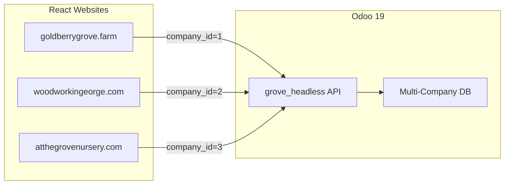

# Grove Odoo Modules

[](https://github.com/Goldberry-Playground/grove-odoo-modules/actions/workflows/ci.yml)

Custom Odoo 19 modules powering the Gather at the Grove multi-tenant ecosystem — three businesses (Goldberry Grove Farm, George George George Woodworking LLC, At The Grove Nursery LLC) on a single Odoo instance.

## Modules

| Module | Purpose | Status |
|--------|---------|--------|
| `grove_headless` | REST API for headless React storefronts (products, cart, CRM) | Active |

## Architecture



Each React website calls the same API endpoints. The `company_id` context (derived from the website/domain) scopes all data to the correct business.

## Deployment

Modules are deployed via **git-sync** — no Docker image rebuild needed.

```
Push to main → GitHub webhook → git-sync pulls → /workspace/current updated → Odoo reads new code
```

Polling interval: 30 seconds (webhook overrides for instant sync).

## Local Development

### Prerequisites

- [odoocker](https://github.com/Goldberry-Playground/odoocker-goldberrygrove) stack running locally
- OrbStack (Docker runtime)

### Setup

1. Clone this repo alongside odoocker:
   ```bash
   cd ~/Documents/Dev\ Projects/gather-at-the-grove/
   git clone git@github.com:Goldberry-Playground/grove-odoo-modules.git
   ```

2. The odoocker `docker-compose.override.local.yml` bind-mounts this repo to `/workspace/current`, so changes are reflected immediately.

3. After adding or modifying a module, restart Odoo:
   ```bash
   cd ../odoocker
   docker compose -f docker-compose.yml -f docker-compose.override.local.yml restart odoo
   ```

4. To install a new module, visit the Odoo Apps menu and click "Update Apps List", then install.

### Module Scaffold

```bash
# Create a new module skeleton
cd grove-odoo-modules/
mkdir grove_mymodule
cat > grove_mymodule/__manifest__.py << 'EOF'
{
    "name": "Grove My Module",
    "version": "19.0.1.0.0",
    "category": "Website",
    "summary": "Description here",
    "author": "Gathering at the Grove",
    "license": "LGPL-3",
    "depends": ["base"],
    "data": [],
    "installable": True,
    "auto_install": False,
}
EOF
cat > grove_mymodule/__init__.py << 'EOF'
EOF
```

## CI

Runs on every push/PR to `main`:
- **Ruff lint**: PEP8 errors, Pyflakes, import sorting (120 char line length)
- **Manifest validation**: Parses `__manifest__.py` files, checks required fields

## Contributing

1. Create a feature branch from `main`
2. Add/modify modules following the `grove_` prefix convention
3. Run linting locally: `ruff check . && ruff format --check .`
4. Open a PR — CI must pass before merge
